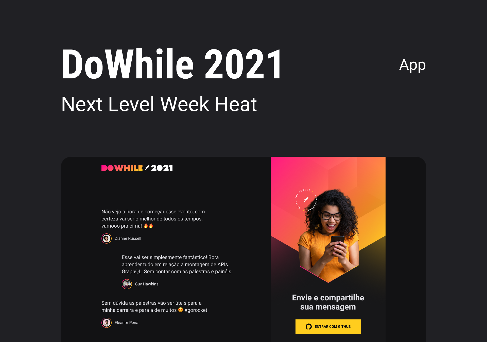

<h1 align="center">
  
</h1>

<p align="center">
  

 
</p>



em construção...

 ## 💻 Projeto
Aplicação para o Dowhile 2021 com propósito de compartilhar mensagem entre os participantes do evento.


## :hammer_and_wrench: Features

- [x] Autenticação social com o GitHub
- [x] Envio e visuzalização de Mensagens em RealTime

## ✨ Tecnologias

- [x] NodeJS
- [x] ReactJS
- [x] React Native
- [x] Typescript
- [x] Expo
- [x] Context API
- [x] OAuth2 Github
- [x] Expo Authentication
- [x] Express
- [x] Socket.io

## 🔖 Layout

Você pode visualizar o layout do projeto através [desse link](https://www.figma.com/file/wLM6Aol5oGEKxz383UoOWJ/%5BNLW-Heat---Mission%3A-Impulse%5D-DoWhile2021-(Community)?node-id=0%3A1). É necessário ter conta no [Figma](http://figma.com/) para acessá-lo.


<!--

## Executando o projeto

Utilize o **yarn** ou o **npm install** para instalar as dependências do projeto.
Em seguida, inicie o projeto.

```cl
expo start
```

Lembre-se de criar o seu App no servidor do Discord para obter as credencias de autenticação. Em seguida, defina no arquivo .env as configurações do seu App (remova o example do arquivo .env.example).

 ```cl
GITHUB_CLIENT_SECRET=
GITHUB_CLIENT_ID=
JWT_SECRET=
```

## 📄 Licença

Esse projeto está sob a licença MIT. Veja o arquivo [LICENSE](LICENSE.md) para mais detalhes.

<br />

<div align="center">
  <small>Desenvolvido por Thiago Silva</small>

  [](https://www.linkedin.com/in/thiago-furtado-silva/)
</div>

-->